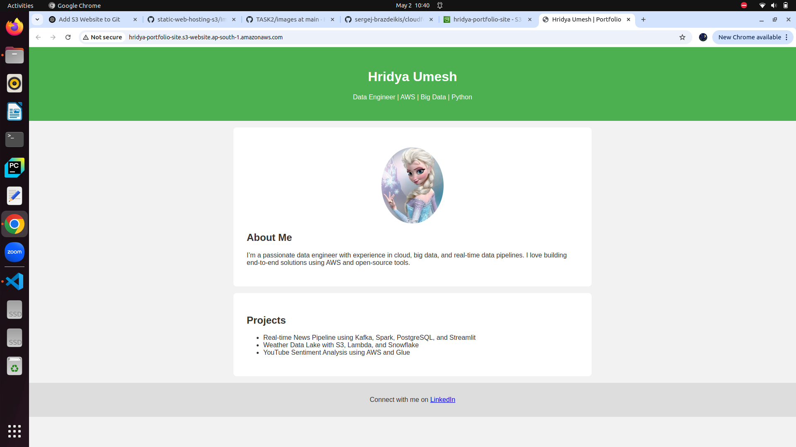

# 🌐 Static Website Hosted on AWS S3

This repository contains a simple static website built using **HTML** and **CSS**, and hosted on **Amazon S3**. It showcases the process of deploying a frontend site using AWS S3's static website hosting feature.

## 📄 Introduction

This project is part of my cloud learning journey. The website is a basic landing page demonstrating static content deployment on AWS. Hosting static websites on S3 is a fundamental skill for web developers and cloud practitioners.

## 🛠️ Technologies Used

- HTML
- CSS
- AWS S3 (Simple Storage Service)

## 🚀 Hosting Steps

1. Created a new S3 bucket with a unique name.
2. Enabled static website hosting in bucket properties.
3. Uploaded `index.html` and `new.css`.
4. Set permissions to make the files publicly readable.
5. Accessed the website using the S3 static hosting URL.

## 🌐 Live URL

*You can view the live version of this website hosted on AWS S3 by clicking the link below:*

[Visit the Website](http://hridya-portfolio-site.s3-website.ap-south-1.amazonaws.com)

## 📸 Screenshot

*Here is the screenshot of my hosted site.*

